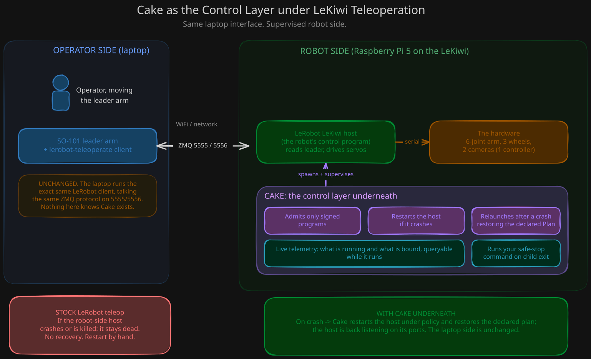

<!-- Copyright 2026 Shinro SAS. Licensed under the Business Source License 1.1; see LICENSE. -->

# kiwi-cake-demo

A precompiled demonstration of Cake, Shinro's control layer for robots,
running underneath the LeRobot host of a LeKiwi. The binaries are published
in this repository's Releases; this repository holds the documentation, the
scripts that run the demo, the tests that check a download, and nothing else.
No source code is distributed.

The demo is released as-is, for evaluation. Read `LIMITATIONS.md` before
you form an opinion, and read `SAFETY.md` before you let it touch a robot.

## What Cake is

Cake is a control layer that runs on the robot, beneath the robot's own host
program. It does not replace the host and it does not touch the wire
protocol between the host and the laptop. It launches the host as a
supervised child process and owns its lifecycle. On top of that process
model it adds four things:

- Signed-program admission. A program runs only inside a signed package that
  Cake verifies before launching anything; a tampered package is refused and
  the refusal names the reason.
- Supervision. When the child dies, Cake records the exit and spawns a fresh
  child under a bounded restart policy.
- Crash recovery of declared state. When Cake itself is killed, its relaunch
  restores exactly the deployment it had declared, byte for byte, and reports
  a fresh session identity.
- Live telemetry. While the resident runs, a local socket answers what is
  running, what is bound to what, and a structured event trace.

More on Cake, beyond this demo, is at https://docs.shinro.dev.

## What this demo does

Every sentence in this list is backed by a measured statement in the demo
record this release derives from or by a line of the development-host gate
record; `docs/claims.md` maps each one to its evidence and says which.

1. Builds a signed package on your machine, with a key you generate, and a
   Plan that names the package by its content identity.
2. Refuses to start when one byte of the stored package is changed, naming
   the content identity, and starts again when the byte is restored. Refuses
   an unsigned copy of the package and a copy signed with a key it does not
   trust.
3. Starts the Cake resident with the package admitted, supervising a child
   process. In segment 1 the child is a harmless line-printing stub. In
   segment 2 it is your own LeRobot host, listening on its usual ports.
4. Answers three read queries over a local admin socket, printed as a live
   table with every event decoded by name.
5. When the child is killed, spawns a fresh child under the next restart
   ordinal, with the exit and the restart in the event trace.
6. When the resident itself is killed with SIGKILL, comes back from the same
   configuration with a fresh session identity while the Plan digest, the
   configuration identity, the build identity and the target-profile digest
   stay identical; the killed resident's child does not survive it.
7. Stops cleanly on request, closing the socket and the child with it.

What it does not do is just as important. It does not perform a live
replacement of a running module, and it does not bring the motors back
disarmed after a crash: the LeRobot host re-enables torque on every connect,
and Cake has no torque concept to override that. `LIMITATIONS.md` states
both plainly.

## Quick start: segment 1, no robot needed

Requirements: a Raspberry Pi 5 running the 64-bit Raspberry Pi OS based on
Debian 13 (trixie) with its default kernel; `git`, `openssl`, `gpg`, `tar`,
and either `curl` or the GitHub CLI `gh`. No LeRobot install is needed and
nothing in segment 1 can move anything.

```
git clone https://github.com/shinro-dev/kiwi-cake-demo.git
cd kiwi-cake-demo
bin/fetch-release.sh
bin/doctor.sh
bin/demo-segment1.sh
```

`fetch-release.sh` detects the board, downloads the matching release
tarball, verifies its checksum and signature, and extracts it under
`release/`. `doctor.sh` reads the facts of your board and tells you in plain
language whether the demo's preflight will accept it. `demo-segment1.sh`
runs the whole torque-free sequence, refusing loudly first if your board
diverges from the tested one, and ends with:

```
KIWI-CAKE SEGMENT 1: PASS
```

`docs/segment-1-stub.md` walks through what each step prints and what it
proves. `tests/smoke-segment1.sh` runs the same sequence with assertions,
which is how you confirm your setup before ever considering segment 2.

## Segment 2: supervising your own LeKiwi host

Segment 2 is opt-in and it moves the arm. It supervises the LeRobot host you
already have installed and working; this demo ships no part of LeRobot. It
runs only on the tested Pi 5 configuration, only after the preflight accepts
the board, only from an interactive terminal, and only after you have typed
the acknowledgment of the physical preconditions that `SAFETY.md` lists.
`docs/segment-2-live.md` is the runbook.

## Supported targets

| Target | Status | Release tarball |
| --- | --- | --- |
| Raspberry Pi 5, Raspberry Pi OS trixie (64-bit), default 16 KiB page kernel, glibc 2.41 | tested and primary | `kiwi-cake-demo-<version>-pi5-aarch64.tar.gz` |
| Raspberry Pi 5 on bookworm, or booted with the 4 KiB kernel | provided as-is; the preflight refuses by construction; segment 1 only, behind `--unsupported-target` | same tarball |
| Raspberry Pi 4 (aarch64) | provided as-is, untested; the preflight refuses by construction; segment 1 only, behind `--unsupported-target` | `kiwi-cake-demo-<version>-pi4-aarch64.tar.gz` (identical binaries to the Pi 5 tarball) |
| x86-64 desktop (the SO-101 desktop case) | not in this release | none |

Every binary requires glibc 2.34 or newer and depends on `libc.so.6` alone.
`docs/targets.md` has the reasoning behind each row and what each preflight
refusal means.

## Safety

- Segment 1 is torque-free by construction and needs no robot.
- Segment 2 enables torque every time the host connects, including after
  every recovery the demo performs. Robot on a stand, wheels off the ground,
  arm parked and supported, hand near power. `SAFETY.md` is mandatory.
- Stop the resident, never the child: `bin/demo-stop.sh`.

## The architecture in one picture



The operator side is unchanged: the same LeRobot client, the same protocol
on the same ports. The robot side gains a control plane beneath the host.
The contrast at the bottom is the failover contrast: with the stock stack, a
host that crashes stays dead until someone restarts it by hand; with Cake
underneath, the host is restarted under policy and is back listening on its
ports. The laptop side is unchanged either way.

## Repository layout

| Path | What it is |
| --- | --- |
| `bin/` | the scripts a user runs: fetch, verify, doctor, the two segments, stop, telemetry |
| `bin/templates/` | the child wrapper, safe-stop command and systemd unit templates for segment 2 |
| `docs/` | the record, the claims map, the target matrix, the two segment runbooks, release verification, event codes |
| `tests/` | the smoke test and the tests of the tooling itself |
| `tools/` | maintainer side: the strings gate and the release assembler |
| `keys/` | the release signing key |
| `releases/` | the committed checksum list of each release, for cross-checking a download |
| `VERSION` | the release version, one line, read by every script and shipped in every tarball |

## Verifying a release

Every release carries `SHA256SUMS`, a detached signature over it, and a
detached signature over each tarball. `bin/verify.sh` checks all of them
against the key in `keys/`; `docs/verifying-a-release.md` shows how to do the
same by hand.

## License

Business Source License 1.1, Licensor Shinro SAS (France). See `LICENSE`,
`LICENSE-NOTE.md` and `NOTICE`. The binaries are provided for evaluation
only, without source and without warranty.
