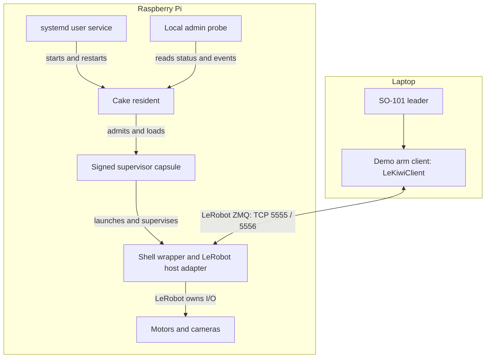

<!-- Copyright 2026 Shinro SAS. Licensed under the Business Source License 1.1; see LICENSE. -->

# How this demo runs the LeKiwi host

Cake supervises the Pi-side host process. LeRobot still handles robot I/O,
commands and observations. The diagram shows segment 2 as shipped, with
one Cake module: the supervisor.

The **resident** is Cake's running process. It loads a **capsule** (a
module package) according to a **Plan** (the declared deployment). Here,
that module runs inside the resident and supervises a single external
LeRobot host process.

The shell wrapper uses `exec` to launch
[the noninteractive host adapter](../bin/pi/lekiwi_host_noninteractive.py).
The adapter replaces LeKiwi's interactive calibration method and then
runs the pinned upstream host. The
[laptop example](../bin/laptop/teleop.py) uses LeRobot's client API and
sets all three base velocities to zero. This is a custom arm-only bench
workflow; the demo does not exercise upstream recording or policy runs.

## Ownership and failure boundaries

| Component | Owns | When it exits |
| --- | --- | --- |
| Laptop client | Leader input and LeRobot client connection | The host can remain running; follow the stop procedure separately |
| LeRobot host | Serial bus, motors, cameras, ZMQ and the host watchdog | Cake records the child exit and applies its restart policy |
| Cake supervisor | Child lifecycle and configured safe-stop command | It is part of the resident; its in-memory state is lost with that process |
| Cake resident | Capsule admission, Plan activation and local admin socket | systemd restarts it after an abnormal exit in segment 2 |
| systemd user service | Resident lifecycle and service process group | An explicit service stop prevents its automatic restart |

The loaded graph has one slot, `supervisor.lekiwi`, one resource and zero
bindings. Cameras and motors are not separate Cake modules. The
[event registry](event-codes.md) names more event types than this graph
exercises.

## Signing and identity boundaries

There are two separate checks:

1. **Release verification:** the fetcher verifies signed checksums and
   the release archive with the published release key. See
   [Verifying a release](verifying-a-release.md).
2. **Runtime admission:** the demo generates a local key, signs the
   supervisor capsule, and creates a Plan naming it by content identity.
   The resident checks that capsule against the configured trusted key.

The Plan itself is unsigned. The capsule's signature does not cover the
external shell wrapper, Python environment, LeRobot checkout or
calibration files. A verified release archive also cannot attest to later
local edits or dependencies installed separately.

The admin socket exposes the session, Plan, configuration, build and
target-profile identities. After a resident crash, the recorded run shows
a new session with the other four identities unchanged. The new resident
activates the configured Plan afresh; the record does not establish
recovery of a committed transaction, module memory or a recording session.
External environment versions need to be recorded separately.

## Process events and robot state

The safe-stop template writes a log line; it sends no motor command.
LeRobot enables torque on successful connect, including after restart.
A hard process death may skip LeRobot's disconnect code. Neither a child
exit event nor a healthy supervisor slot proves that wheels stopped or
motors were disarmed.

Use [Safety](../SAFETY.md) and [Stopping and cleanup](stopping-and-cleanup.md)
for physical operation. Use [Diagnosing a run](diagnosing-a-run.md) to
interpret software evidence. The [claims map](claims.md) and
[limitations](../LIMITATIONS.md) distinguish these observations from the
broader Cake architecture described at [docs.shinro.dev](https://docs.shinro.dev).
